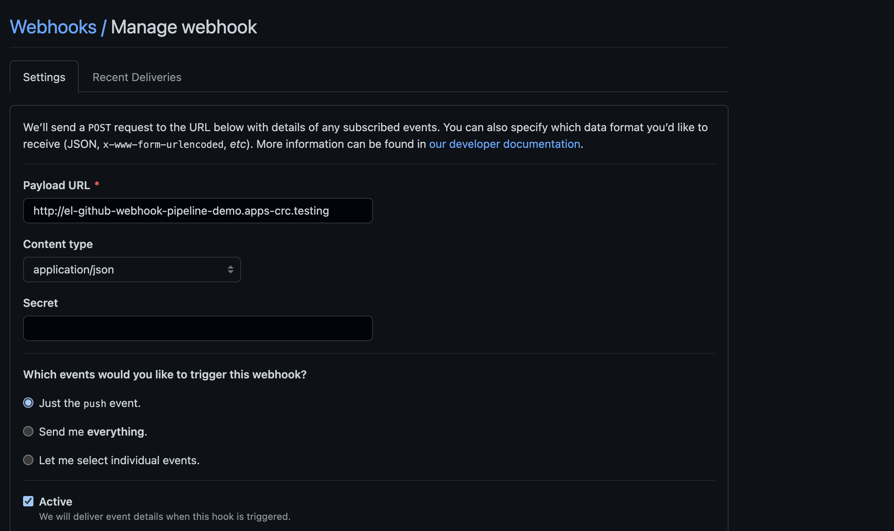

# Introduction to Tekton using OpenShift Pipelines Demo

Welcome to the Introduction to Tekton using OpenShift Pipelines demo!

## Tekton
[Tekton](https://tekton.dev/), is a powerful and flexible Kubernetes-native open-source CI/CD framework that enable developers to build test and deploy across cloud providers and on-premise by abstracting away the underlying details. 

[Tekton](https://tekton.dev/) is optimized for containerized application that runs in [Kubernetes](https://kubernetes.io/), running as a serverless solution, there is no need for a central service/engine that require ongoing management and maintenance. [Tekton](https://tekton.dev/) attempt to bridge the gap of in-cluster build and deployment at scale and was built for distributed, collaborative teams in mind working on microservices or even more traditional monolitic applications.

## OpenShift Pipelines
[Openshift Pipelines](https://www.openshift.com/learn/topics/ci-cd) is a cloud-native CI/CD solution for building pipelines based on [Tekton](https://tekton.dev/). It builds on [Tekton](https://tekton.dev/) to provide a CI/CD experience through tight integration with [OpenShift](https://www.redhat.com/en/technologies/cloud-computing/openshift) and Red Hat developer tools. [Openshift Pipelines](https://www.openshift.com/learn/topics/ci-cd) is designed to run each step of the CI/CD pipeline in its own container, allowing each step to scale independently to meet the demands of the pipeline.

#### OpenShift Pipelines features:
  * Standard CI/CD pipeline definition based on Tekton
  * Build images with Kubernetes tools such as S2I, Buildah, Buildpacks, Kaniko, etc
  * Deploy applications to multiple platforms such as Kubernetes, serverless and VMs
  * Easy to extend and integrate with existing tools
  * Scale pipelines on-demand
  * Portable across any Kubernetes platform
  * Designed for microservices and decentralized teams
  * Integrated with the OpenShift Developer Console

## Overview

This tutorial will walk you through different concepts of Tekton and OpenShift Pipelines while given you some practical knowledge of the tool. It will walk you through pipeline concepts and how to create and run a simple pipeline for building and deploying Cloud Native applications using OpenShift Pipelines

The tutorial is divide in different section:
* [Learn about Tekton concepts](#concepts)
* [Install OpenShift Pipelines](#install-openshift-pipelines)
* [Use Cluster Tasks](#user-cluster-tasks)
* [Create a Pipeline](#create-pipeline)
* [Use OpenShift Pipelines builder to run Pipeline](#run-pipeline)
* [Trigger a Pipeline](#trigger-pipeline)


### Prerequisites

* Any Openshift cluster 4.x or CodeReady Container base on OCP 4.3+
* OpenShift CLI `oc` install and connected to your cluster
* The [Tekton CLI](https://github.com/tektoncd/cli) `tkn` install
* [Kustomize](https://kustomize.io/)

### Concepts

[Tekton](https://tekton.dev/) defines several [Kubernetes custom resources](https://kubernetes.io/docs/concepts/extend-kubernetes/api-extension/custom-resources/) as building blocks to standardize pipeline concepts and provide terminology that is consistent across CI/CD solutions. These custom resources are an extension of the Kubernetes API that lets users create and interact with these objects using [Kubernetes](https://kubernetes.io/) tools.

The custom resources needed to define a pipeline are listed below:
* `Task`: a reusable, loosely coupled number of steps that perform a specific task (e.g. building a container image)
* `Pipeline`: the definition of the pipeline and the `Tasks` that it should perform
* `TaskRun`: the execution and result of running an instance of a task
* `PipelineRun`: the execution and result of running an instance of a pipeline, which includes several `TaskRuns`
* `Pipeline Resources`: The set of objects that are going to be used as inputs to a `Task` and can be output by a `Task`
* `Workspace`: Concept by which the Task step and Pipeline task can share a common filesystem. 
* [`Triggers`](#triggers): Concept that allows you to automate the running of pipelines ex: A GitHub push triggers a PipelineRun. Using `tektoncd/triggers` with `tektoncd/pipeline` enables you to
easily create a complete CI/CD systems where the execution is
**entirely** Kubernetes-native.


#### Steps to create a pipeline:
* Create custom or install existing reusable `Tasks` from the [catalogue](https://github.com/tektoncd/catalog)
* Create a `Pipeline` and `PipelineResources` to define your application's delivery pipeline
* Create a `PersistentVolumeClaim` to provide the volume/filesystem for pipeline execution or provide a `VolumeClaimTemplate` which creates a `PersistentVolumeClaim`
* Create a `PipelineRun` to instantiate and invoke the pipeline

[Tekton documentation](https://github.com/tektoncd/pipeline/tree/master/docs#learn-more) 

[Tekton Trigger documentation](https://github.com/tektoncd/triggers/blob/master/docs/README.md)


### Install OpenShift Pipelines

[Openshift Pipelines](https://www.openshift.com/learn/topics/ci-cd) is provided as an add-on on top of Openshift to benefit from Tekton. It can be installed via an operator available in the Openshift OperatorHub. [Here](https://catalog.redhat.com/software/operators/explore) a way to explore what is available. 

The operator can be installed using the Operator Hub inside the OpenShift Console. Follow [these instruction](/docs/install-pipeline-operator.md) to install the operator using the console,

### Tasks

There are 2 types of tasks that can be used in Tekton.

`Task`: Are namespace or project bound. The task can be seen using the OpenShift console under `Pipelines ->Tasks->Task` or by using Tekton CLI with the following command: Remember you need to be in the right project since they are project bound.
```
tkn task ls
```

`Cluster Taks`: Are available across the cluster. When installing the Operators, there are already some pre-install cluster tasks. The cluster task can be seen using the OpenShift console under `Pipelines ->Tasks->ClusterTask` or by using Tekton CLI with the following command:
```
tkn clustertask ls
```

Output should look something like this:


### Create Pipeline

In this tutorial, we will create a Cloud-Native pipeline using cluster tasks.  Here is what the pipeline needs to do.

1. Clone the source code from GitHub. The source code for this service can be found [here]().

1. Use maven task to build and run the test on the application.

1.  Use maven to build the source code.

1. Use buildah to build the container image and push it to the internal container registry

1. Deploy the application in OpenShift. We want to deploy the application as a Serverless Knative application


#### Preparation

There are possibility.
* [Option 1](#option-1) Use Kustomize to create the entire thing.
* [Option 2](#option-1) Create eveything step by step.
* [Option 3](#option-2) Use Kustomize to bootstrap the project.

#### Option 1:

Create the entire project using this script: We use a loops since the installation of the operators can delay things.

```
until oc apply -k setup/overlays/demo
do
  sleep 20
done
```
:warning: if you use that option the demo is over, just review what was created in your cluster and execute the pipelinerun or trigger.

---

#### Option 2:

Create a project to use for this tutorial using the OpenShift CLI.

```
oc new-project pipeline-demo
```

Install OpenShift Serverless operator in your OpenShift cluster. Follow [these instruction](/docs/install-serverless-operator.md) to install the operator using the console if not already present.

#### Option 3:

Create the project and install the Openshift operator by execution this script: We use a loops since the installation of the operators can delay things.

```
until oc apply -k setup/overlays/demo
do
  sleep 20
done
```
---

OpenShift Pipelines will automatically add and configures a `Service Account` named pipeline that had sufficient permission. Verify if the service account was created with the following command:

```
oc get serviceaccount
```

To run the maven tasks we need to create two workspace. One to store the source code and one to cache de maven dependencies. For this, we will create 2 PVC `sources-pvc` and `maven-repo-pvc` using the following command.
```
oc apply -n pipeline-demo -f tekton/workspaces/source-pvc.yaml

oc apply -n pipeline-demo -f tekton/workspaces/maven-repo-pvc.yaml
```

#### Required Cluster Task

To create the pipeline we need the following cluster tasks to be available:
* Git Clone
* Maven
* Buildah
* Openshift Client
* Kn client

#### Create the Pipeline

We have finished setting up our environment, it is now time to deploy the pipeline. 
```
oc apply -n pipeline-demo -f tekton/pipelines/knative-app-pipeline.yaml
```

#### Create the PipelineRun

Now that the pipeline is deploy. Lets create a pipelinerun tu run the pipeline manually.

```
oc create -n pipeline-demo -f tekton/pipelineruns/simple-quarkus-service-run.yaml
```

### Triggers

As of now, we have been running the pipeline manually, which is nice in certain cases. But what about automation. In a complete CI/CD workflow we want these pipelines to be trigger automatically. Hence the need to triggers.

Here are the different elements in a trigger:

* `TriggerTemplate`: defines a resource template that receives input from the `TriggerBindings`, while then performing a series of actions that result in the creation of new `PipelineResources` and initiation of a new `PipelineRun`.
* `TriggerBindings`: extract the fields from an event payload and store them as parameters.
*`EventListeners`: provide an endpoint, or an event sink, that listen for incoming HTTP-based events with a JSON payload. The `EventListener` performs lightweight event processing on the payload using Event Interceptors, which identify the type of payload and optionally modify it. Pipeline Triggers support four types of Interceptors: Webhook Interceptors, GitHub Interceptors, GitLab Interceptors, and Common Expression Language (CEL) Interceptors.


#### Create a Trigger for Github.

Now that we have the pipeline created let create a `TriggerTemplate`:
```
oc apply -n pipeline-demo -f tekton/triggers/simple-quarkus-service-trigger-template.yaml
```

Then we need to create the `TriggerBinding` for a GitHub payload:
```
oc apply -n pipeline-demo -f tekton/triggers/github-pr-trigger-binding.yaml
```

Now we can create the eventListener and expose the service:
```
oc apply -n pipeline-demo -f tekton/triggers/github-eventlistener.yaml
```

Now, let's expose the service and retrieve the route URL

```
oc expose svc el-github-webhook

oc get route el-github-webhook
```

Retrieve the URL needed to create the required Webhook in GitHub

```
echo "URL: $(oc  get route el-github-webhook --template='http://{{.spec.host}}')"
```

#### Create the GitHub Webhook

Open [GitHub](https://github.com/)  in the right repository, go to setting -> Webhook -> Add Webhook

Before you click Add webhook it should look similar to this.



You can now push a change to the repository, it should trigger the pipeline.