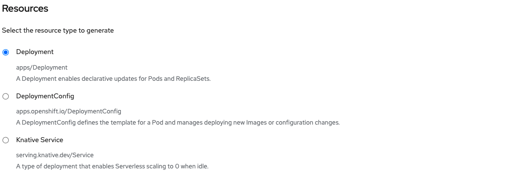

# Install OpenShift Serverless operator

OpenShift Serverless is provided as an add-on on top of OpenShift that can be installed via an operator that is available in the OpenShift OperatorHub.

## Steps:

First, connect to OpenShift console with a user that has Cluster administration right and make sure you are on the Administrator perspective as shown below:

Then, go `Operators -> OperatorHub`. You should now see a list of available operators for OpenShift provided by Red Hat, the community and our partners.

To facilitate the process, in the `Filter by keyword...`, type OpenShift Serverless to find the required operator:

Click on the Openshift Serverless operator to start the installation.  Leave the default setting and click install to start the installation process.

Once the installation is done, you should now see the OpenShift Serverless Operator in the Installed Operators tab, as shown below:

Now that the installation is done. Let's go into the operator in the knative-serving project to create a Knative Serving as shown below:

Create a Knative by selecting the button, leave everything as default.

Click create. You should now see the serving as below.

:tada: CONGRATULATIONS 
The operator is now installed on the cluster with a Serving created. Applications can now be deployed as a Knative Service.

The Serverless option should now be available in the left menu, as shown here:

